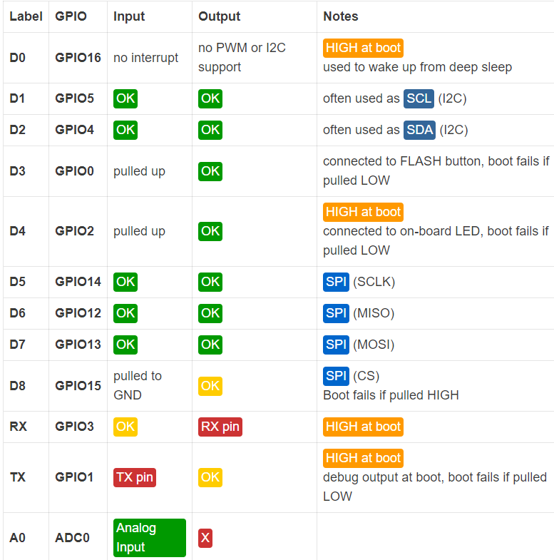
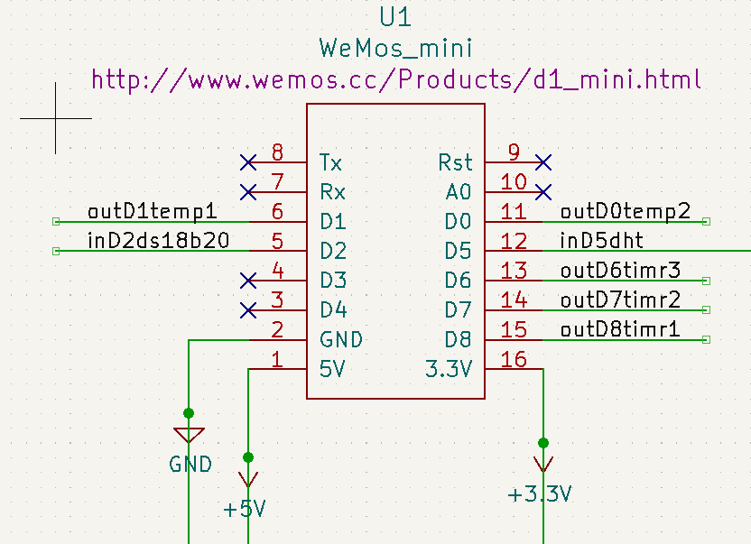

# boards and ports

You can safely use 8 ports in a 8266. D1, D2, D3, D4, D5, D6, D7 and AO. 

output
 - D1, D2, D3, D4, D5, D6, D7 
 
input
- D1, D2, D5, D6, D7 
- D3, D4 are pulled up but OK for input
- A0 is the one analog input

Ports used in 8266_2in-4out board are shown. The outD0temp2 connection may be problematic (see notes in the allowed ports diagram)

