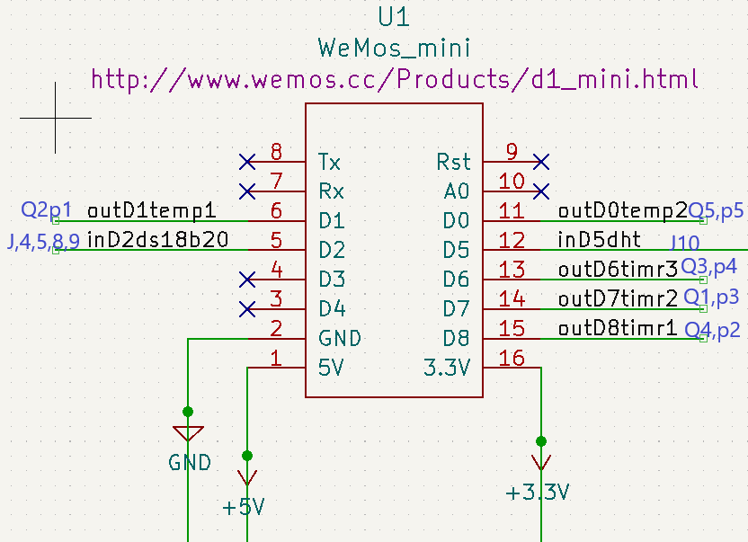
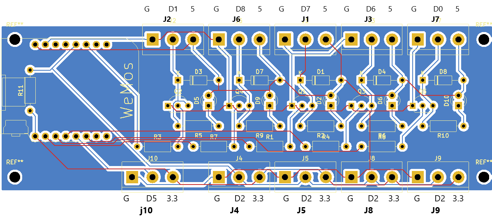
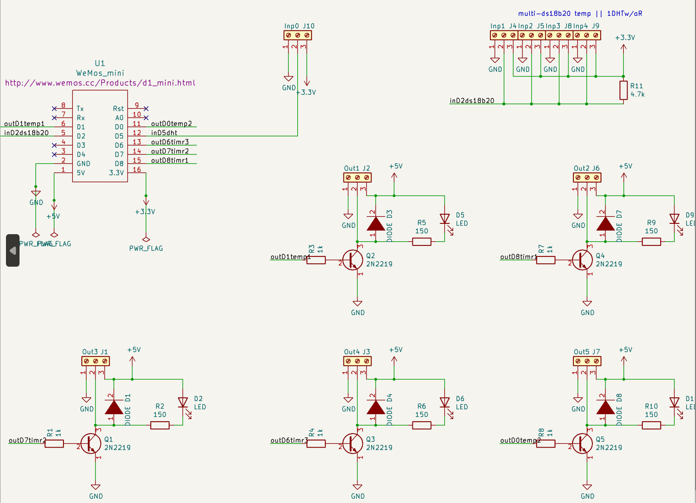

# boards and ports

You can safely use 8 ports in a 8266. D1, D2, D3, D4, D5, D6, D7 and AO. 

output
 - D1, D2, D3, D4, D5, D6, D7 
 
input
- D1, D2, D5, D6, D7 
- D3, D4 are pulled up but OK for input
- A0 is the one analog input

    /*PORTS for INPUT*/
    const portsin_t inpo {
      DO, //DONT USE out longPCB p5        
      D1, //out longPCB p1
      D2, //inp longPCB J4,5,8,9 onewire
      D5, //inp longPCB J10
      D6, //SPIdo out longPCB p4
      D7, //shares i2c D2 and D1 out longPCB p3
      D8, ///SPIcs pulled gnd, boot fails if hi out longPCB p2
      A0, //ANALOG
      D3, //pulled up
      D4};//pulled up
    /*SE constant declarations*/  

Ports used in 8266_2in-4out board are shown. The outD0temp2 connection may be problematic (see notes in the allowed ports diagram)

[long](boards/long.pdf)